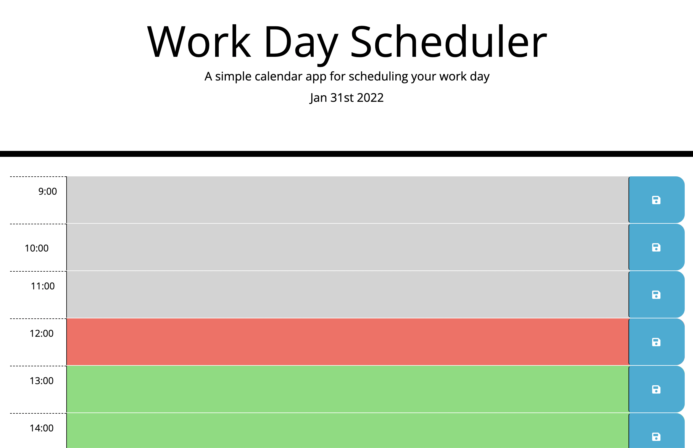

# Work-Day-Scheduler: Third- Party APIs Challenge

### An employee with a busy schedule wants a daily planner for events so that they can manage their time effectively

#### The planner includes current data, time blocks for standard business hours, color-coded blocks to indicate past, present or future, and a save button that saves to local storage

### Usage

- HTML
- CSS
- jQuery

## Deployed page:

https://chamibia.github.io/scheduler/

### Preview

#### Made by Bianca Chami
